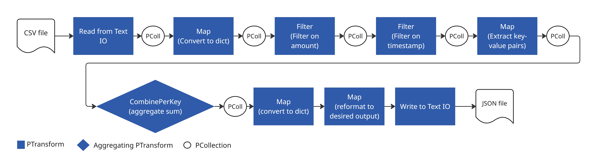

# apache-beam-sample-transactions-pipeline

This repo contains a simple Apache Beam pipeline used to ingest and process a sample transactions dataset: "gs://cloud-samples-data/bigquery/sample-transactions/transactions.csv" by default.

Transformations include:
- Filtering for all transactions have a `transaction_amount` greater than `20`
- Filtering for transactions made on or after the year `2010`
- Summing the total by `date`

The resulting dataset is output to `output/results.jsonl.gz`

## Pre-reqs

Create a virtual env with required python dependencies, the requirement.txt is included for this:
- Create: `python -m venv .venv`
- Activate: `source .venv/bin/activate`
- Install reqs: `pip install -r requirements.txt`

Install and configure Google Cloud CLI (steps for this outlined below).

## Executing the pipeline

Run `python src/transactions_pipeline.py`

To run against a different source file, use `python src/transactions_pipeline.py --csv-file-path <path to csv>`

Unit tests use pytest and can be run from the repo root with the virtual env activated using `pytest`.

A simple bash file `setup_and_run_pipeline.sh` has been included to create the virtual environment and run the pipeline in one command `bash setup_and_run_pipeline.sh`. Similarly, `setup_and_run_tests_and_pipeline.sh` will run the unit tests and then the pipeline once/if the tests pass.

## Pipeline Diagram

The diagram below shows a schematic of the Pipeline steps.

## Improvements/Considerations

1. Improvement: Schema validation

    Beam reads the row into separate PCollections for parallel execution. Whilst we implement error handling of column types and date format, the schema is assumed rather than determined by the headers and/or validated. Suggestion could be to read in the headers separately and validate the schema before running the main data pipeline.

    Note: Beam allows for schemas to be defined on PCollections too. The documentation has some information about creating a schema for a PCollection [here](https://beam.apache.org/documentation/programming-guide/#creating-schemas).

2. Improvement: Allow parametrised filtering using side inputs - https://beam.apache.org/documentation/programming-guide/#side-inputs

3. Consideration: Combining filters into one

    As can be seen from the diagram above, there are some consecutive `Map` and `Filter` operations, which could perhaps be combined.

    Seperate filters -> modular testing and debugging & better readability
    Potentially optimizable with ParDo "fusion" - https://beam.apache.org/releases/javadoc/current/org/apache/beam/sdk/transforms/ParDo.html

## Notes - Getting Started

### Installing Apache Beam

https://beam.apache.org/get-started/quickstart-py/

apache-beam[gcp] also required for google cloud storage

### Google Cloud CLI - installation and authentication

**Install google cloud CLI, authenticate, set project**

Set project `gcloud config set project <project id>` - Cloud Platform project to operate on by default. [See docs](https://docs.cloud.google.com/sdk/gcloud/reference/config/set) 
Set the quota project (in your local Application Default Credentials file) `gcloud auth application-default set-quota-project <project id>` - Google Cloud Project that will be used for billing and quota limits. [See docs](https://docs.cloud.google.com/sdk/gcloud/reference/auth/application-default/set-quota-project)

https://docs.cloud.google.com/docs/authentication/provide-credentials-adc#how-to
https://docs.cloud.google.com/sdk/docs/install#linux

## Notes - Apache Beam

### Programming Guide

https://beam.apache.org/documentation/programming-guide/

Beam SDKs provide a number of abstractions:
- `Pipeline`: Encapsulates the entire processing task from start to finish. Beam driver programme must create a `Pipeline`, including execution options.
- `PCollection`: A distributed dataset that the pipeline operates on. They are the inputs and outputs of each step in the pipeline. Can be "bounded" (from a fixed/static source), or "unbounded" (from a continuously updating/streaming source)
- `PTransform`: A data processing operation, or step, in the pipeline. Takes one or more `PCollection` as input, performs some processing task, and outputs zero or more `PCollection`s.
- I/O transforms: IO libraries supply I/O `PTransforms`s that read or write to external sources.

### Reading and writing

The `io` module contains multiple different classes for reading and writing to/from files https://beam.apache.org/releases/pydoc/current/apache_beam.io.textio.html  
The programming guide has a [section on this](https://beam.apache.org/documentation/programming-guide/#pipeline-io), which shows some basic `ReadFromText` and `WriteToText` IO `PTransform` subclasses in use.

We use these same subclasses in our pipeline, additional optional parameters are documented [here](https://beam.apache.org/releases/pydoc/current/apache_beam.io.textio.html).

Note: by default the output file(s) will be suffixed with the shard number as '-SSSSS-of-NNNNN' (the default `shard_name_template`) where S is the shard number repsonsible for that particular file and N is the total number of shards. Since the ask was to output as `output/results.jsonl.gz`, we have explicitly set the `num_shards` to 1 and the `shard_name_template` to an empty string.

Briefly considered using `ReadFromCsv`. The rows were `BeamSchema_...` type objects, the docs on beam schemas [here](https://beam.apache.org/documentation/programming-guide/#schemas) may help. Also requires an additional dependency on pandas. Noted as a potential improvement for helping to solve our schema assumption issue.

### Transforms

All of the transforms listed below are documented in the [programming guide](https://beam.apache.org/documentation/programming-guide/#transforms) and the [documentation](https://beam.apache.org/documentation/transforms/python/overview/)  
The Map function is documented in the documentation [here](https://beam.apache.org/documentation/transforms/python/elementwise/map/)  
The notes in this section condense information from the documentation relevant for our pipeline.

#### Map

Applies a 1:1 mapping function over each element in the `PCollection` - returns one element for each element in the `PCollection`

#### ParDo

Parallel processing operation -> useful for anything that can be done row-wise, i.e. operating on rows in isolation.

"The ParDo processing paradigm is similar to the “Map” phase of a Map/Shuffle/Reduce-style algorithm: a ParDo transform considers each element in the input PCollection, performs some processing function (your user code) on that element, and emits zero, one, or multiple elements to an output PCollection."

"When you apply a ParDo transform, you’ll need to provide user code in the form of a DoFn object. DoFn is a Beam SDK class that defines a distributed processing function."

Filtering: Can use ParDo or specific `Filter` method https://beam.apache.org/documentation/transforms/python/elementwise/filter/  
**Input - each row is represented as a dictionary**

#### GroupByKey

Parallel reduction operation for processing collections of key/value pairs.

"analogous to the Shuffle phase of a Map/Shuffle/Reduce-style algorithm"

**Input - collection of key/value pairs**.

#### Combine

Combining entire PCollections or, in some cases, combining values for keys in PCollections of key/value pairs.

`CombinePerKey` can be used to perform `GroupByKey` followed by an aggregation of the collection of values.
An example is shown here - https://beam.apache.org/documentation/transforms/python/aggregation/sum/

#### Composite transform

A composite transform can be created as a `PTransform` subclass that consists of multiple nested/chained transforms.
The recommended approach is to create a `PTransform` subclass and override the `expand` method with the required transforms/processing logic for a `PCollection`.

https://beam.apache.org/documentation/programming-guide/#composite-transform-creation
https://stackoverflow.com/questions/75539817/apache-beam-map-dofn-and-composite-transform

#### Composite transform and unit testing 

Recommended approach for unit testing - https://beam.apache.org/blog/unit-testing-in-beam/
- Use `beam.Pipeline()` to test your transformations in a pipeline context.
- Use `beam.Create()` to create a PCollection from input test cases.
- Apply your composite test function to the PCollection
- Capture the result from the pipeline and assert against the expected output using the beam testing utils `apache_beam.testing.util.assert_that` and `apache_beam.testing.util.equal_to`, which will resolve the PCollection and perform the assertion.

[See also](https://beam.apache.org/documentation/pipelines/test-your-pipeline/#:~:text=testing%20package%20documentation.-,An%20Example%20Test%20for%20a%20Composite%20Transform,-The%20following%20code)
